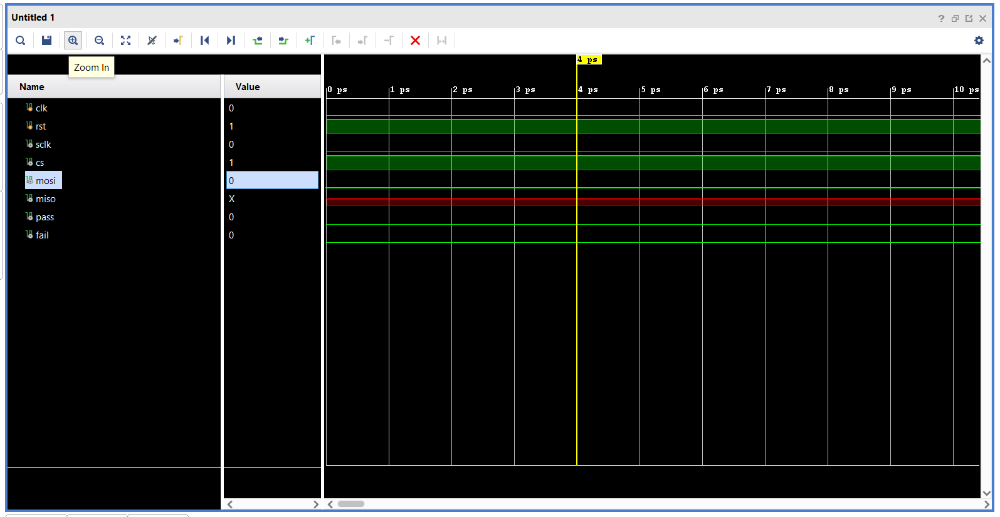

Basic SPI Data Transfer using FPGA (Verilog)
1. Project Overview

This mini project implements basic SPI (Serial Peripheral Interface) communication entirely in Verilog HDL, verified through simulation in Vivado.

The FPGA acts as an SPI Master

A Dummy SPI Slave is modeled in Verilog

No external hardware or SPI device is required

The design demonstrates SPI Mode-0 communication, bit-wise serial data transfer, and protocol timing

The project is intended as a learning-oriented implementation of SPI, focusing on how SPI works internally, rather than on advanced peripherals.

2. Project Objective

✔ Transmit one byte (0xA5) from SPI Master
✔ Receive one byte (0x3C) from SPI Slave
✔ Verify received data
✔ Indicate result using PASS / FAIL signal
✔ Observe all SPI signals in simulation

3. SPI Configuration

| Parameter    | Value                       |
| ------------ | --------------------------- |
| SPI Mode     | Mode 0                      |
| CPOL         | 0 (Clock idle LOW)          |
| CPHA         | 0 (Sample on rising edge)   |
| Data Order   | MSB first                   |
| Data Width   | 8 bits                      |
| Transaction  | Single-byte transfer        |
| Clock Source | FPGA system clock (100 MHz) |

4. Project Architecture

+-------------+        SPI Bus        +------------------+
| SPI Master  | ---------------------| Dummy SPI Slave  |
|   (FPGA)    |  SCLK, CS, MOSI, MISO |   (Verilog)     |
+-------------+                      +------------------+
                  |
                  |
               PASS / FAIL

5. File Structure

SPI_MODULATION/
│
├── spi_master.v        # SPI Master implementation
├── spi_slave_dummy.v  # Dummy SPI Slave implementation
├── spi_top.v           # Top-level integration
├── tb_spi_top.v        # Testbench for simulation
└── README.md

Detailed File Descriptions & Code Explanation

1️⃣ spi_master.v — SPI Master Module

🔹 Purpose

This module implements the SPI Master logic, responsible for:

.Generating SPI Clock (SCLK)

.Controlling Chip Select (CS)

.Transmitting data on MOSI

.Receiving data from MISO

.Managing SPI timing (Mode-0)

🔹 Functional Overview

1. Waits for start signal

2. Pulls CS LOW to select slave

3. Generates SCLK

4. Shifts out data bit-by-bit on MOSI

5. Samples incoming bits from MISO

6. Completes transfer and raises done

🔹 Important Internal Signals

| Signal     | Description                   |
| ---------- | ----------------------------- |
| `tx_data`  | Byte to transmit (`0xA5`)     |
| `rx_data`  | Byte received from slave      |
| `tx_shift` | Transmit shift register       |
| `rx_shift` | Receive shift register        |
| `bit_cnt`  | Counts transmitted bits (0–7) |
| `sclk`     | SPI clock generated by master |
| `cs`       | Active-LOW chip select        |
| `mosi`     | Master Out Slave In           |
| `miso`     | Master In Slave Out           |

🔹 SPI Timing (Mode 0)

SCLK idle LOW

MOSI changes on falling edge

MISO sampled on rising edge

🔹 Data Shifting Mechanism

Transmit (MOSI):
mosi <= tx_shift[7];   // Send MSB first
tx_shift <= {tx_shift[6:0], 1'b0};

Receive (MISO):
rx_shift <= {rx_shift[6:0], miso};

🔹 End of Transfer:
After 8 clock cycles:
cs is de-asserted (HIGH)
rx_data is latched
done signal is asserted

2️⃣ spi_slave_dummy.v — Dummy SPI Slave Module
🔹 Purpose

This module simulates a simple SPI Slave that:

Does not generate clock

Responds only when CS is LOW

Sends a fixed byte (0x3C)

Ignores MOSI data (for simplicity)

🔹 Why Dummy Slave?

✔ Allows SPI verification without hardware
✔ Ideal for understanding SPI timing
✔ Simplifies debugging and learning

🔹 Slave Behavior

1. Detects CS LOW

2. Loads fixed response (0x3C)

3. Shifts data out on falling edge of SCLK

4. Drives data on MISO

🔹 Key Design Rule Followed

SPI Slave never generates clock — only responds to master clock

🔹 Shift Register Logic 

miso <= slave_shift[7];
slave_shift <= {slave_shift[6:0], 1'b0};

3️⃣ spi_top.v — Top-Level Module
🔹 Purpose

This module connects everything together:

Instantiates SPI Master

Instantiates Dummy SPI Slave

Automatically starts SPI transaction

Compares received data

Generates PASS / FAIL output

🔹 Functional Flow

1. Reset applied

2. SPI transfer automatically starts

3. Master sends 0xA5

4. Slave responds with 0x3C

5. Received data is checked

6. PASS or FAIL is asserted

🔹 Data Verification Logic

if (rx_data == 8'h3C)
    pass <= 1'b1;
else
    fail <= 1'b1;

🔹 Why a Top Module?

✔ Central control
✔ Clean integration
✔ Easy FPGA mapping
✔ Easier testbench design

4️⃣ tb_spi_top.v — Testbench
🔹 Purpose

The testbench verifies the entire SPI system in simulation.

🔹 What the Testbench Does

✔ Generates 100 MHz FPGA clock
✔ Applies reset
✔ Observes SPI signals
✔ Displays PASS / FAIL
✔ Enables waveform analysis

🔹 Simulation Observation:
 we run the simulation on vivado and get the result like:
 

 🔁 Step-by-Step Data Flow (End-to-End)

1️⃣ Reset asserted

2️⃣ SPI Master initializes

3️⃣ CS pulled LOW

4️⃣ SPI clock starts

5️⃣ MOSI transmits 10100101

6️⃣ Slave shifts out 00111100

7️⃣ Master samples MISO on rising edge

8️⃣ After 8 bits, transfer ends

9️⃣ Received data compared

🔟 PASS / FAIL generated

🔹Key Learnings

SPI protocol fundamentals

CPOL / CPHA timing

Serial-to-parallel conversion

Shift-register based communication

FPGA protocol modeling

Simulation-based verification

🔹Tools Used

Vivado Design Suite

Verilog HDL

Vivado Waveform Viewer / GTKWave

👥 Contributors

🔹 Ujwal

🔹 Ujwal

Role: Top Module Integration & Verification

Designed the Top module

Integrated SPI Master and SPI Slave

Implemented automatic SPI start after reset

Compared transmitted and received data

Generated PASS / FAIL output

Developed the Testbench:

Generated FPGA clock

Applied reset

Observed SCLK, CS, MOSI, MISO

Verified SPI transfer in simulation

🔹 Incharaa (https://github.com/IncharaaShivaprakash/IncharaaShivaprakash)

Role: SPI Master Design

Designed SPI Master

Implemented SCLK, CS, MOSI logic

Implemented shift registers

Ensured SPI Mode-0 compliance

Contribution: Designing and Implementation of SPI Master Module.
● Designing SPI master logic in verilog HDL
● Generating all SPI control signals: Serial Clock (SCLK), Chip Select (CS), Master out
slave in (MOSI)
● Recieving data via the Master in slave out (MISO) line
● Implementing shift register based serial data transmission and reception
● Making sure of correct SPI Mode-0 (CPOL=0, CPHA = 0)
● Handling transaction start, end and reset conditions

🔹 Aradhya (https://github.com/aradhya101)

Role: SPI Slave Design

Designed Dummy SPI Slave

Implemented fixed response (0x3C)

Implemented MISO shift logic

Ensured correct slave timing

Learning Resources:

🔹 Vivado installation and SetUp
1. https://www.youtube.com/watch?si=e_4kKj7fOBpXytX6&v=W8k0cfSOFbs&feature=youtu.be
2. https://www.youtube.com/watch?v=-U1OzeV9EKg
3. https://www.youtube.com/watch?v=bw7umthnRYw&feature=youtu.be
4. https://www.youtube.com/playlist?list=PLmLQnr2Fjat0WpVSmZ76kkMtSWie2DBpQ

SPI related Resources

1. https://youtu.be/AV0w0Ko7D6E?si=LeWXZZPq2TrwtU3f (For SPI basics, part 1)
2. https://youtu.be/3EtKfSIJADw?si=VlOuTJDha0-j72hh (For SPI basics, part 2)
3. https://www.youtube.com/watch?v=hiCm95SieSE (SPI basics+code implementation+testbench)
4. https://youtube.com/playlist?list=PL-rm6ajteTiSzUBOgbqTFRMXgwaX5Jq3M&si=yhsXUoZ1UEr1oIpy (Playlist for SPI communication)
5. https://www.youtube.com/playlist?list=PLnAoag7Ew-vq5kOyfyNN50xL718AtLoCQ (SPI based playlist with emphasis on Verilog implementation)

